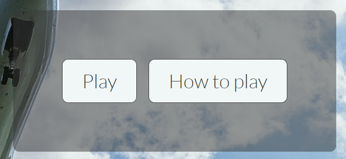
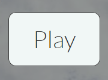
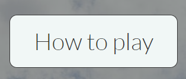
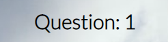
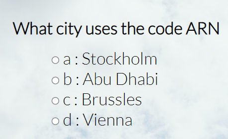
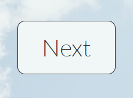
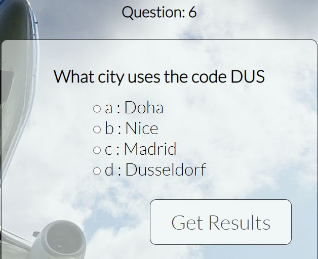
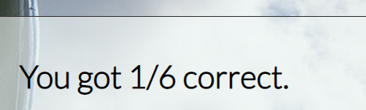
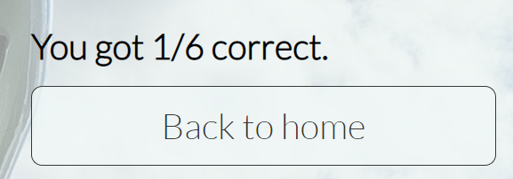

# Introduction
The Airport Quiz is a quiz for people who like to travel and wonder what different codes airports use

# User Experience
## Goals
The goal for this quiz is for people to enjoy finding out what code belong to which airport, as a lot of the time it is not always the obvious answer

## User Stories
As a user I want to:
- Play a game that is visually pleasing
- Navigate easily around the quiz
- See how many questions I have answered 
- See what score I got
- Be brought back to the home page once I've completed the quiz 
- Play a resonably relaxing quiz

## Scope
The aim of this project is to be a quiz that has multiple choice questions. There will be 6 questions to answer, with the number of questions answered being displayed. A message will be displayed at the end with the final score.

## Structure 

Home page 
- Title displays on the top of the home page and quiz page
- Play button which starts the quiz
- How to play button which explains how to play the quiz

Quiz page
- The question counter is displayed underneath the title 
- The question is displayed in the middle of the page
- Four answers to choose from are displayed underneath the question
- A next button is displayed on the bottom right to bring the user to the next question

End of quiz
- A get results button is displayed on the bottom right
- A message is displayed with the final score
- A back to home button is displayed underneath the final score message

## Skeleton 
The quiz was designed using two pages, with the buttons and questions being displayed in boxes in the center of the page

## Surface 
### Theme
The theme of the quiz is based around an airplane

### Background image
The background image of a plane flying is used to keep in with the airport theme. It's white and blue colours give an eye catching yet calming and clean aesthetic and what many would associate with looking out a plane window.

### Colours
The colours choosen were to complement the background image and to not take away from the blue and white, while still standing out

### Font
Lato was choosen as the font as it is easy to read while having a sleek design to it

# Features
## Exsisting Features
### Home page
- The title is displayed at the top of the home page and the quiz page

- There is a box that contains the play button and how to play button

- The play button navigates to the quiz page

- The how to play button navigates to the modal

### Quiz page
- Underneath the title is the question counter 

- Underneath this is a box that displays the question and four answers to choose from

- Inside this box, displayed on the bottom right, is a next button that navigates to the next question

- On the last question, a get result button is displayed on the bottom right

- When the get results button is clicked, the score from the quiz is displayed 

- Underneath the score is a back to home button, which navigates back to the home page

