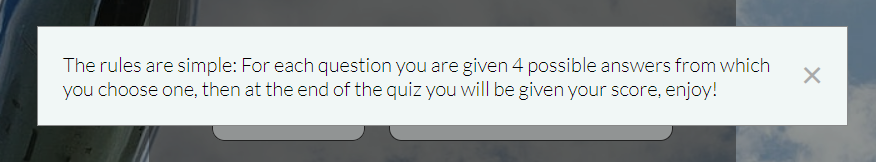
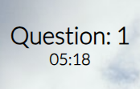
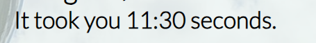

Live website [here](https://lanacreegan.github.io/airport-quiz/index.html)

# Introduction
The Airport Quiz is a quiz for people who like to travel and wonder what different codes airports use

# User Experience
## Goals
The goal for this quiz is for people to enjoy finding out what code belong to which airport, as a lot of the time it is not always the obvious answer

## User Stories
As a user I want to:
- Play a game that is visually pleasing
- Navigate easily around the quiz
- See how many questions I have answered 
- See what score I got
- Be brought back to the home page once I've completed the quiz 
- Play a resonably relaxing quiz
- See how long it took to complete the quiz

## Scope
The aim of this project is to be a quiz that has multiple choice questions. There will be 6 questions to answer, with the number of questions answered being displayed. To keep the user guessing, their score will be displayed at the end of the quiz

## Structure 

Home page 
- Title displays on the top of the home page and quiz page
- Play button which starts the quiz
- How to play button which explains how to play the quiz

Quiz page
- The question counter is displayed underneath the title 
- The question is displayed in the middle of the page
- A timer is displayed underneath the question number
- Four answers to choose from are displayed underneath the question
- A next button is displayed on the bottom right to bring the user to the next question

End of quiz
- A get results button is displayed on the bottom right
- A message is displayed with the final score
- A back to home button is displayed underneath the final score message and how long it took to complete the quiz

## Skeleton 
The quiz was designed using two pages, with the buttons and questions being displayed in boxes in the center of the page

## Wireframe 
- Wireframe for home page can be found [here](./assets/images/home-page-wireframe.png)
- Wireframe for quiz page can be found [here](./assets/images/quiz-page-wireframe.png)
- Wireframe for end of quiz can be found [here](./assets/images/finish-page-wireframe.png)

## Surface 
### Theme
The theme of the quiz is based around an airplane

### Background image
The background image of a plane flying is used to keep in with the airport theme. It's white and blue colours give an eye catching yet calming and clean aesthetic and what many would associate with looking out a plane window.

### Colours
The colours choosen were to complement the background image and to not take away from the blue and white, while still standing out

### Font
Lato was choosen as the font as it is easy to read while having a sleek design to it

# Features
## Exsisting Features
### Home page

### Title
- The title is displayed at the top of the home page and the quiz page

### Button box
- There is a box that contains the play button and how to play button

### Play button
- The play button navigates to the quiz page

### How to play button
- The how to play button navigates to the modal

### Modal
- The modal gives instructions on how to play the quiz

### Quiz page

### Question counter
- Underneath the title is the question counter 

### Quiz box
- Underneath this is a box that displays the question and four answers to choose from

### Next button
- Inside this box, displayed on the bottom right, is a next button that navigates to the next question

### Get results button
- On the last question, a get result button is displayed on the bottom right

### Score
- When the get results button is clicked, the score from the quiz is displayed 

### Back to home button
- Underneath the score is a back to home button, which navigates back to the home page

### Timer 
- Underneath the question number there is a timer 

- At the end of the quiz the timer stops and the users total time to complete the quiz is shown

## Future features 
 Furture features that would be added:
 - Increase the number of questions being asked
 - Randomise questions so if the user were to play it a number of times the questions would not show in the same order
 - An exit button back to the home page that would allow the user to leave in the middle of the quiz, currently this can only be done by clicking on the title
- Save scores so the user could try beat their old score

## Lanuguages used
- HTML(HyperText Markup Language) was used as the basis of the website
- CSS(Cascading Style Sheets) was used to style the website
- JavaScript was used to add interactivity  

## Technologies used
- [Balsamiq](https://balsamiq.com/) was used to create wireframes 
- [Gitpod](https://www.gitpod.io/) the IDE used 
- [Favicon](https://favicon.io/) was used to get the favicon for the broswer tab
- [CompressJPEG](https://compressjpeg.com/) was used to compress the background image
- [Coolors](https://coolors.co/) was used to choose the colours for the quiz
- [ColorHexa](https://www.colorhexa.com/eff7f6) was used for colour conversion
- [Raw Labs](https://raw-labs.com/) was used to host the API

## User Stories
As a user, I want to test my knowledge of airport codes:
- The home page has an eye catching airplane and blue and white colours in the background. The title of the quiz "Airport Quiz" is displayed at the top of the page. The user will then be drawn to the play button which stands in the dark coloured box it's situated in

As a user, I want to know how to play the game:
- This can be done by the How the play button. The button then brings up a modal with instructions on how to play the game

As a user, I want to know how many questions I've answered:
- This can be done by the question counter at the top of the page which displays how many questions have been answered

As a user, I want to answer questions about airport codes:
- This can be done by the quiz box below the question counter. This displays a question and underneath the question are 4 possible answers from the user to choose from. There are 6 questions in total

As a user, I want to be able to navigate to the next question:
- This can be done by the next button which is located on the bottom right of the quiz box

As a user, I want to be able to get my score:
- This can be done by the get results button which is locted on the bottom right of the quiz box when the user comes to the last question. When clicked, a message will be displayed saying the users score out of 6

As a user, I want to know how long it has taken me to complete the quiz:
- This can be done by viewing the timer at the top of the page underneath the question number. The user can then see the final time at the end of the quiz 

As a user, I want to be able to navigate back to the home page:
- This can be done by the back to home button located below the score the user got once they are finished the quiz. Once clicked, this will then bring the user back to the home page

## Testing
### Validator Tests
The W3C Markup Validation Service was used to validate the HTML
- For the index.html, there are no errors and one warning for section lacking headings, this can be seen [here](./assets/images/html-validator.png)
- For quiz.html, there are no errors and one warning for empty heading, this can be seen [here](./assets/images/empty-heading-warning.png)

The W3C CSS Validation Service was used to validate the CSS of the website
- this passed with no errors which can be seen [here](./assets/images/css-validator.png). There was one warning which relates to the imported style sheets for Google Fonts which can be seen [here](./assets/images/css-warning.png)

The JSHint validator was used to validate two JavaScript files
- This passed with no errors and one warning for the quiz.js file for the body of for should be wrapped in an if statement which can be seen [here](./assets/images/jshint-warning.png)

Lighthouse was used to test the performance
- Home page results [here](./assets/images/lighthouse-index.png)
- Quiz page results [here](./assets/images/lighthouse-quiz.png)

## Further testing
The website was tested on the following browsers
- Google Chrome
- Safari
- Microsoft Edge

The website was tested on the following devices
- iPhone
- Samsung Galaxy S22
- ASUS 15" laptop

## Manual testing
The quiz was tested multiple times by various people

#### Home page
The following functions as expected:
- The play button brings the user to the quiz page 
- The modal pops up when the user clicks on the how to play button

#### Quiz page
The following functions as expected:
- Title brings the user back to the home page
- The next button brings the user to the next question
- Question counter increments by 1 with every question answered
- The get results button displays the score 
- The back to home button brings the user back to the home page

## Bugs
- The title wasn't linking back to the home page, upon examination the anchor element had been placed inside the h1 tag. This was fixed by placing it outside the h1 tag
- When deployed the back to home button would display a 404 error. When being examined there was a foward slash in the href. This was fixed by taking out the foward slash out of the href
- When on the last question the next buttom was still available. When clicked it would throw an error because there wasn't any more questions. This was fixed by checking if there was another question. If not remove the next button 
- When deploed the favicon wouldn't work and give a 404 error. This was fixed by removing the foward slash in the href

## Deployment
The project was deployed to GitHub Pages by following these steps:

- Log in to GitHub and go to the GitHub Repository
- Select airport-quiz within the repository
- Navigate to the settings tab
- Scroll down to pages under the Code and Automation section
- Under branch select main
- The page automatically refreshes and the link for the website is displayed at the top of the pages section

## Fork
The repository can be forked by following these steps:

- Log into GitHub and go to the GitHub Repository
- Locate fork in the top right hand corner of the page and click on it
- Select an owner for the forked repository
- Then select if you want to copy the default branch or all branches to the new fork
- Click create fork

## Clone
The repository can be cloned by following these steps:

- Log into GitHub and go to the GitHub Repository
- Click on the code button on the right above the files list
- Then select HTTPS and copy the URL
- Open Git Bash
- Change the current working to the location you want the cloned directory to be
- Type git clone and paste the URL from earlier
- Press enter to create the local clone

## Credits 
### Content 
Questions were written by me, codes for the airports were gotten from [here](https://www.ccra.com/airport-codes/)

### Code
Tutorials that were followed initailly to set up the JavaScript and apadated were:
- https://www.sitepoint.com/simple-javascript-quiz/

Learning resources:
- https://www.w3schools.com/jsref/prop_node_nextsibling.asp
- https://www.w3schools.com/js/js_object_definition.asp
- https://developer.mozilla.org/en-US/docs/Web/JavaScript/Guide/Working_with_Objects
- https://www.youtube.com/watch?v=f4fB9Xg2JEY&t=3051s&ab_channel=BrianDesign
- https://developer.mozilla.org/en-US/docs/Web/API/Fetch_API/Using_Fetch
- https://blog.hubspot.com/website/javascript-wait#:~:text=The%20setTimeout()%20function%20is,snippet%20after%20a%20specified%20delay.&text=The%20setTimeout()%20function%20accepts,milliseconds%20before%20executing%20the%20function.
- https://foolishdeveloper.com/create-a-simple-stopwatch-using-javascript-tutorial-code/

Tutorial that was followed for the modal: 
- https://www.w3schools.com/howto/howto_css_modals.asp

### Media
The background image was got from:
- https://unsplash.com/